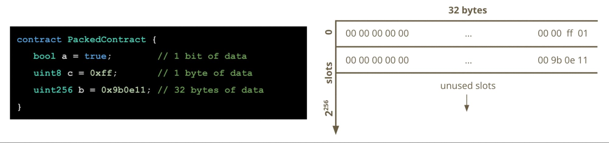

# Fundamental 

## Ethereum
- [store data in smart contract storage](#data-storage)
- [Token standard](#token-standard)
- [Proxy](#proxy)

## Data Storage
```
8 bits = 1 bytes
4 bits = 1/2 bytes = 1 hex
```

## Address

```ruby
await contract.address
'0x73311fFBED20f72C8E76F583A15DA81eE5819171'
```

`Address` length = 40 = 40 hex = 20 bytes = 160 bits

## Storage

[How are state variables padded and packed in smart contract storage slots?](https://docs.alchemy.com/docs/smart-contract-storage-layout#how-are-state-variables-stored-in-smart-contract-storage-slots)


storage-slots

**Storage** have contain 2<sup>256</sup> slots

Get contract storage at slot 0

```ruby
await web3.eth.getStorageAt(contract.address, 0, console.log())
'0x0000000000000000000000010bc04aa6aac163a6b3667636d798fa053d43bd11'
```
1 slot have 32 bytes = 64 hex = 256 bits

## Token standard

- [ERC-20](https://eips.ethereum.org/EIPS/eip-20): Token Standard
- [ERC-721](https://eips.ethereum.org/EIPS/eip-721): NFT (Non-Fungible Token) Standard

## Proxy

- [Proxy constructor init data](https://blog.openzeppelin.com/proxy-patterns)
- [Proxy constructor init data](https://docs.openzeppelin.com/contracts/4.x/api/proxy#ERC1967Proxy-constructor-address-bytes-)
- [ERC-1967: Proxy Storage Slots](https://eips.ethereum.org/EIPS/eip-1967)